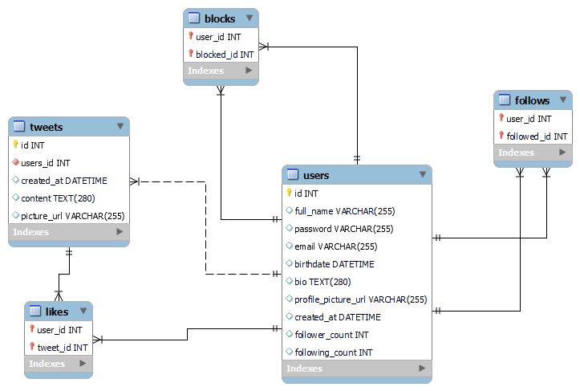
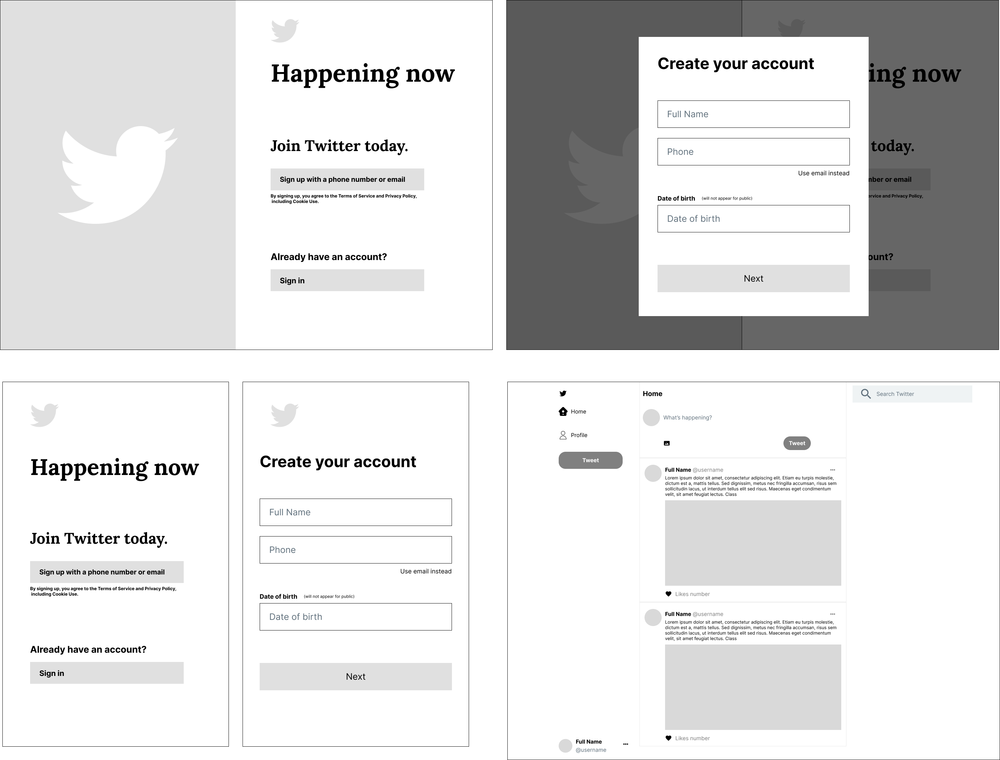
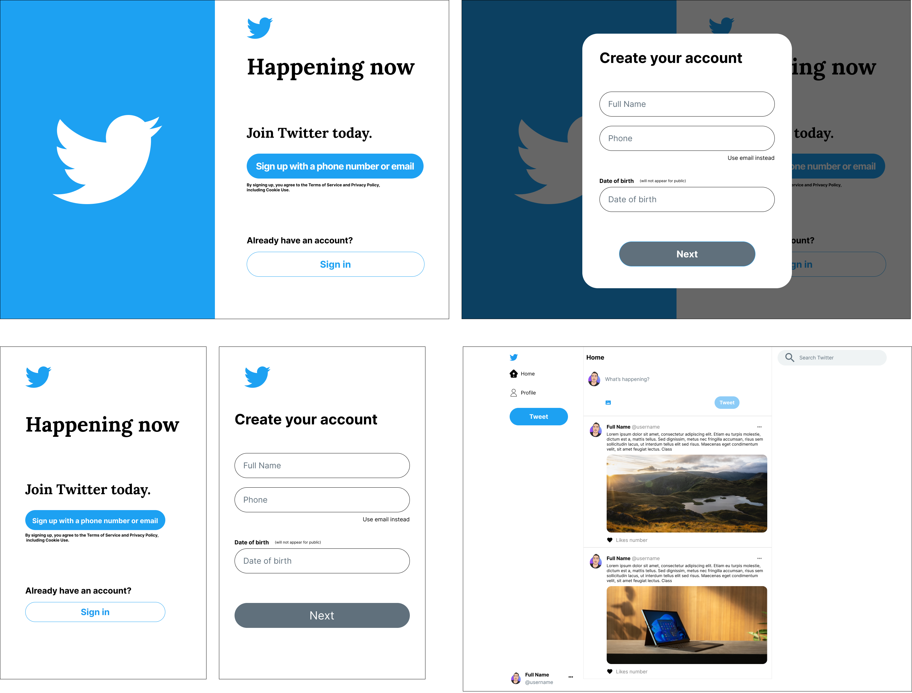
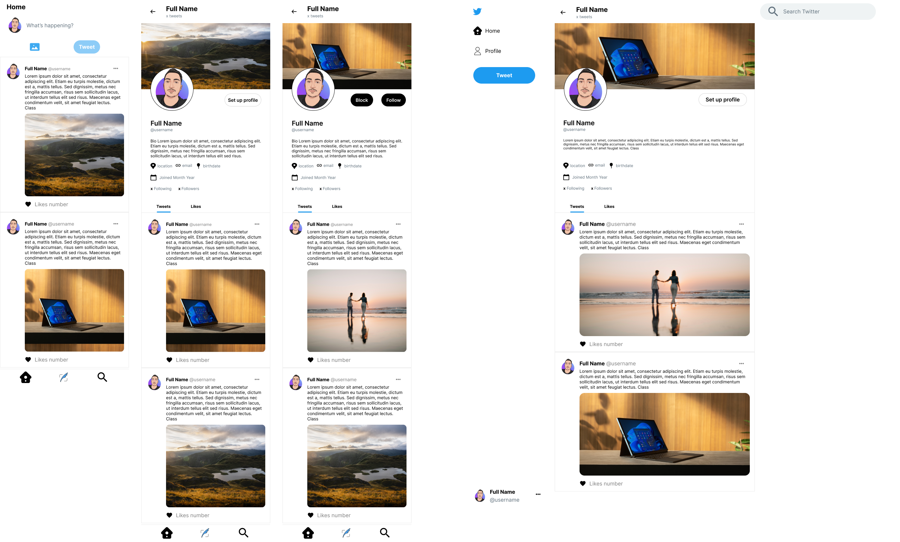

# Twitter clone team project

First Group Project is to clone Twitter (Frontend & Backend):

- The website should look exactly the same on the desktop (should be responsive too)
- Users must be able to login, register, and edit profile.
- Users must be able to tweet (280 chars) and attach pictures.
- Users must be able to follow each other
- Users must be able to block each other
- Users must be able to search for each other
- Users must be able to like tweets.
- Deadline: Sunday, September 18th, 2022 at 11:59 PM.
- Deliverable: GitHub Repo Link.

---

## TEAM Members

#### - Project director & frontend developer:

<a href='https://github.com/abdallahmoubarak'>Abdallah Moubarak

</a>

#### - Backend developer:

<a href='https://github.com/petersaba'> Peter Saba

</a>

---

## Project Process

#### Stage 1: creating ER diagram for the project

---

#### Stage 2: creating Figma design

##### Wireframe:

##### Mockup:

---

#### Stage 3: creating two branches for the project (frontend and backend)

repo link : https://github.com/abdallahmoubarak/twitter-clone-team-project

- Substage 1 : developing frontend pages using (html - css- js)
- Substage 2 : implementing database
- Substage 3 : developing api's using (php)
- Substage 4 : fetching api and fitting them in frontend

---

#### Stage 4: Presenting the project
